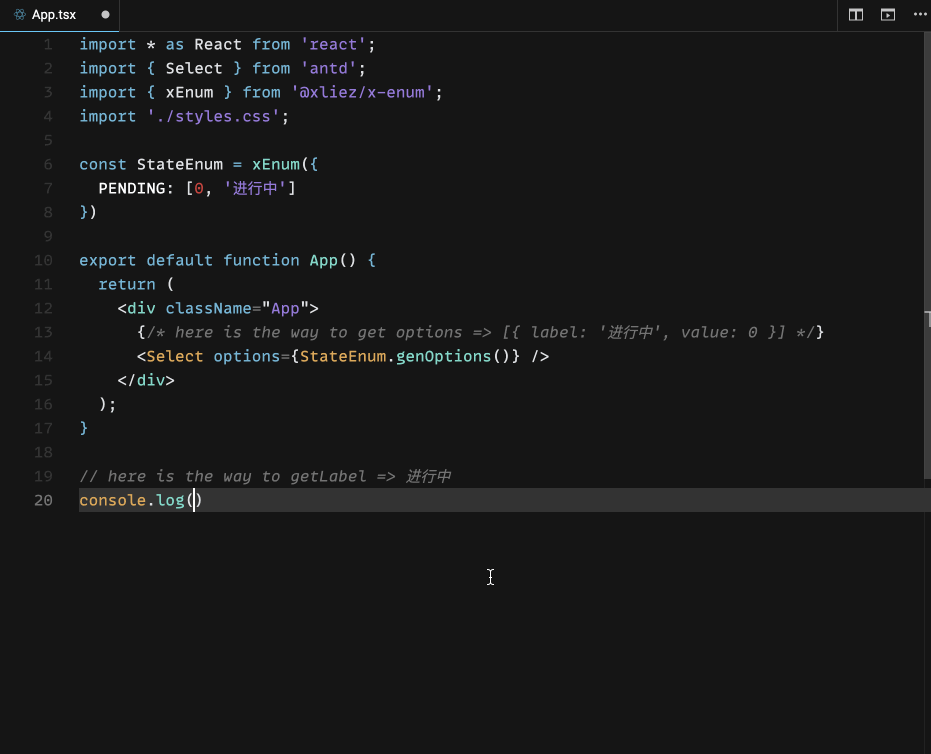

# x-enum

管理枚举值的工具，支持快速获取 `key`、`value`、`label`，支持生成 `Select` 组件的 `options`。

提供较好的 TS 类型支持。



## 动机

在业务中，我们经常需要维护一些枚举值，如状态、类型，这些枚举值包含 `key: 唯一键(一般为英文)`、`value: 值(对应后端存储的数据)`、`label: 中文名(用于展示)`。

之前我会这样去维护这些枚举值：

```ts
export enum STATUS {
  // key -> value
  TODO = 1,
  PENDING = 2,
  DONE = 3,
}

export const STATUS_TEXT = {
  // key -> value -> label
  [STATUS.TODO]: "todo",
  [STATUS.PENDING]: "pending",
  [STATUS.DONE]: "done",
};
```

但是这样的维护方式有以下几个问题：

1. `STATUS_TEXT` 的 key 被转为 `string` 而非 `number`, 需要转换
2. 无法快速生成 Select 组件的 options
3. 根据 value 取 label 比较繁琐，需要 `STATUS_TEXT[STATUS.TODO]`

因此我总结了 B 端场景下的以下这些常见使用场景：

1. select 组件的 options: 一般为 `{ label: string; value: string | number }[]` 这样的数据
2. 根据 key 获取 value
3. 根据 key 获取 label
4. 根据 value 获取 label
5. 根据 value 获取 key
6. 获取所有的 key
7. 获取所有的 value
8. 获取所有的 label

该函数工具封装了以上业务场景的方法，方便维护枚举值，并且**TS 支持 key 值的枚举推断**

## 使用方式

### install

```bash
npm i @xliez/x-enum
# or
yarn add @xliez/x-enum
# or
pnpm add @xliez/x-enum
```

### example

```ts
import { Select } from "antd";
import { xEnum } from "@xliez/x-enum";

const TypeEnum = xEnum({
  TODO: [0, "待办"],
  PENDING: [1, "处理中"],
  DONE: [2, "已完成"],
});

// 1. 生成 select 组件 options
const App = () => {
  return (
    <>
      <Select label="select" name="select" options={TypeEnum.genOptions()} />
    </>
  );
};

// 2. 根据 key 取 value
const value = TypeEnum.TODO.value; // 支持TS推断
// or
const value = TypeEnum.valueByKey("TODO");

// 3. 根据 key 取 label
const label = TypeEnum.TODO.label; // 支持TS推断
// or
const label = TypeEnum.labelByKey("TODO");

// 4. 获取 key 字符串
const key = TypeEnum.TODO.key; // 支持TS推断

// 5. 根据 value 取 label
const label = TypeEnum.labelByValue(0);

// 6. 根据 value 取 key
const key = TypeEnum.keyByValue(0);

// 7. 获取所有的 key
const keys = TypeEnum.keys;

// 8. 获取所有的 value
const values = TypeEnum.values;

// 9. 获取所有的 label
const labels = TypeEnum.labels;

// 10.获取 value 的联合类型，类似 TS 中的 enum 类型
type T = TypeEnum._TYPE_; // => 0 | 1 | 2  防止和key冲突，加了下划线
const a: T = 0;
```

## API

### `xEnum(enumObj: Record<string, [number | string, string?]>)`

一般情况：

```ts
const TypeEnum = xEnum({
  TODO: [0, "待办"],
  PENDING: [1, "处理中"],
  DONE: [2, "已完成"],
});
```

如果你使用 key 作为 label：

```ts
const TypeEnum = xEnum({
  待办: [0],
  PENDING: [1, "处理中"],
  DONE: [2, "已完成"],
});
```

### `xEnum(enumObj: Record<string, [number | string, string?]>))`返回值

| 方法名         | 参数                       | 返回值                                         | 说明                                                                                                                                                        |
| -------------- | -------------------------- | ---------------------------------------------- | ----------------------------------------------------------------------------------------------------------------------------------------------------------- |
| `genOptions`   | `names?: [string, string]` | `{ label: string; value: string \| number }[]` | 生成 select 组件 options `names` 参数对应生成的`label` `value`的名称，默认为 `['label', 'value']`, 如果传`[a, b]`，则生成的是 `{a: string, b: value}[]`类型 |
| `valueByKey`   | `key: string`              | `number`                                       | 根据 key 取 value                                                                                                                                           |
| `labelByKey`   | `key: string`              | `string`                                       | 根据 key 取 label                                                                                                                                           |
| `labelByValue` | `value: number`            | `string`                                       | 根据 value 取 label                                                                                                                                         |
| `keyByValue`   | `value: number`            | `string`                                       | 根据 value 取 key                                                                                                                                           |
| `keys`         | -                          | `string[]`                                     | 获取所有的 key                                                                                                                                              |
| `values`       | -                          | `number[]`                                     | 获取所有的 value                                                                                                                                            |
| `labels`       | -                          | `string[]`                                     | 获取所有的 label                                                                                                                                            |
| `_TYPE_`       | -                          | `number \| string`                             | 获取 value 的联合类型，类似 TS 中的 enum 类型                                                                                                               |
